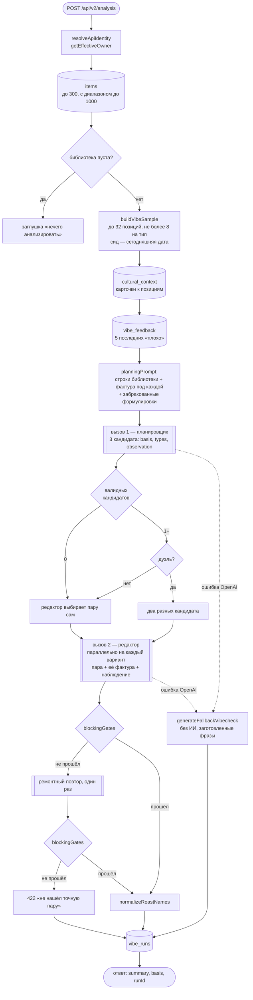
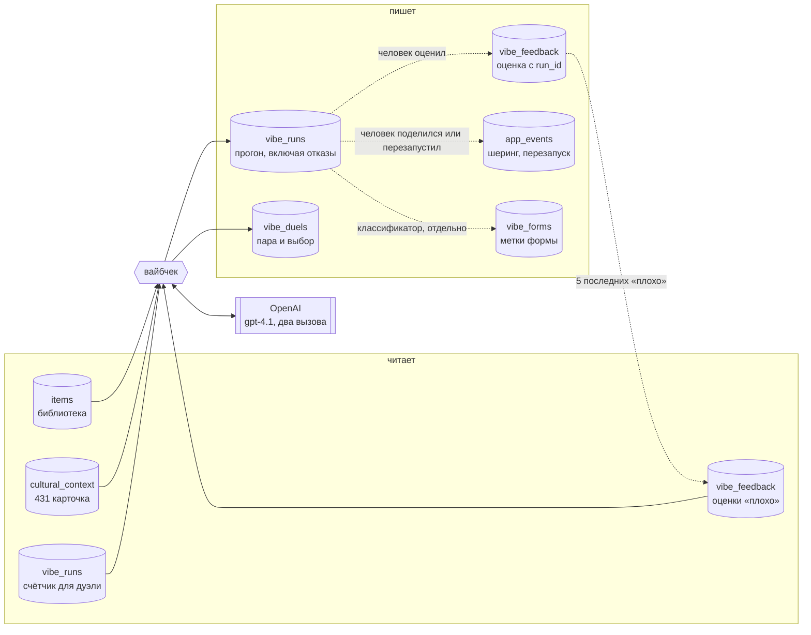
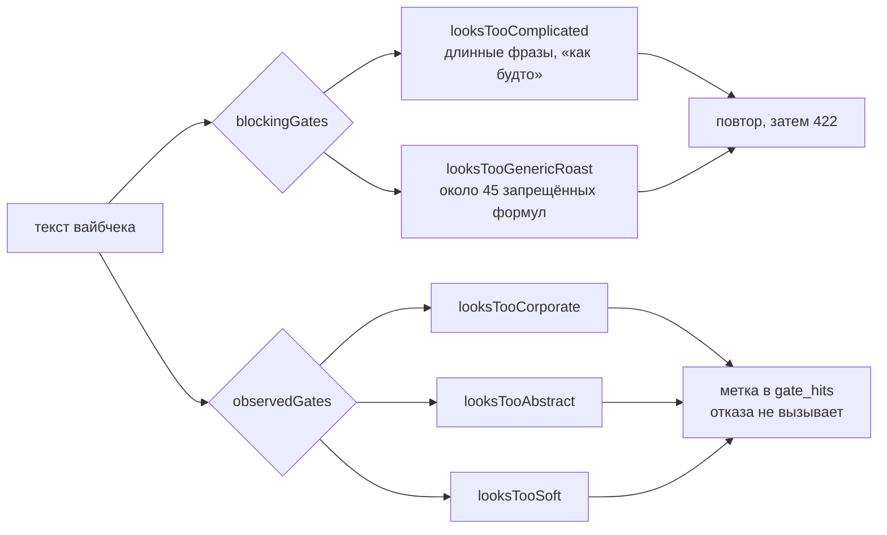
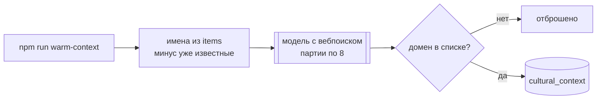

# Вайбчек

Короткая прожарка по библиотеке. Роут `app/api/v2/analysis/route.ts`, окно функции 60 секунд.

## Ход одного запроса

Условие дуэли: заголовок `x-vibecheck-duel: 1`, `VIBECHECK_DUEL_EVERY` больше нуля, не менее двух валидных кандидатов, и число доставленных прогонов владельца кратно N. По умолчанию N = 5.

## Источники данных

## Что откуда берётся

| Источник | Как попадает в промпт | Ограничение |
|---|---|---|
| `items` | до 32 позиций выборки | не более 8 на тип, дубли по автору отбрасываются |
| `cultural_context` | фактура под каждой позицией и под выбранной парой | запрос тянет до 400 карточек, совпадение по ключу и алиасам |
| `vibe_feedback` | блок «уже забраковал эти формулировки» | 5 последних с оценкой «плохо», только свои |

Карточку нельзя пересказывать и нельзя называть источник — она опора для наблюдения, а не содержание.

## Фильтры

Наблюдающие фильтры сняты с боевого пути 2026-08-31 в коммите `1d39166`. Они возвращены только как счётчики: `looksTooSoft` запрещает слово «кажется», с которого начинается образцовый вайбчек в самой инструкции редактора.

## Наполнение карточек

Отдельный процесс, в тракте запроса не участвует.

Разрешённые издания: The Atlantic, New Yorker, NYT, «Медуза», The Bell, Кинопоиск, WOS, архив «Афиши» до 2021 года, X и Facebook Ильи Красильщика, Wonderzine. Для «Афиши» проверяется ещё и дата публикации.

Замер на 2026-09-06: из 431 карточки 288 годны, 143 нет — 103 пустой похвалы, 42 новостных повода, 13 канцелярита. Фильтра на входе пока нет.

## Что собирается для будущего

`vibe_runs` пишется на каждом выходе, включая 422 и фоллбэк: выбранная пара, наблюдение планировщика, состав типов, сработавшие фильтры, число повторов, версия промпта, признак контрольной группы.

Ничего из этого сейчас на вайбчек не влияет. Это материал для следующего шага — см. план петли обратной связи.
